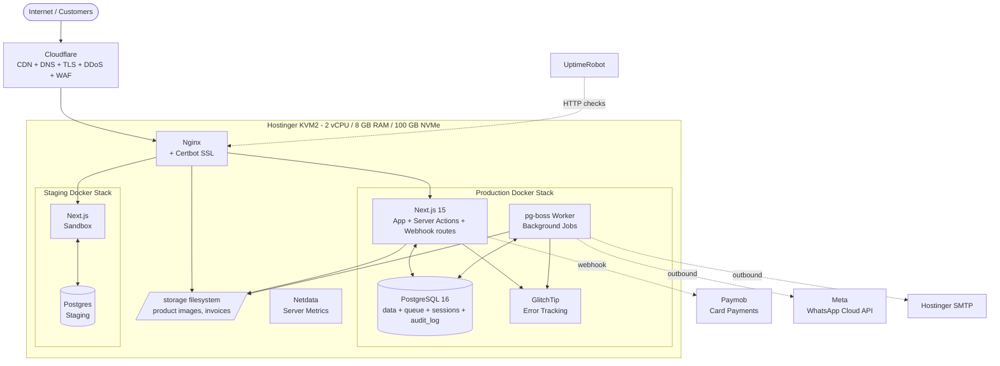

# Print By Falcon — System Architecture

## 1. Overview

Print By Falcon is a single Next.js 15 full-stack application running on a single Hostinger KVM2 VPS (2 vCPU / 8 GB RAM / 100 GB NVMe). It serves three distinct surfaces:

- **B2C storefront** (server-rendered for SEO) — Egyptian individual buyers
- **B2B portal** (server-rendered with client-side cart/bulk-order tools) — Egyptian companies
- **Admin panel** (`/admin/*`, client-rendered) — owner, ops team, sales reps

Backend logic runs as Next.js Server Actions and API route handlers. Background jobs run in a separate Node worker process (pg-boss). Persistence is PostgreSQL 16 (the same DB also stores sessions and queue state). File storage (product images, invoice PDFs) lives on the VPS filesystem and is served by Nginx behind **Cloudflare Free** as the CDN/DNS/TLS edge (per ADR-024 — supersedes ADR-023).

The architecture is deliberately small and boring: one VPS, one database, one application, one worker. This matches the expected scale (100–500 daily visitors) and the team size (3 developers shipping in 6 months).

---

## 2. Components

| Component | Responsibility | Tech | Location |
|---|---|---|---|
| Web app | Storefront, B2B portal, admin panel, server actions, webhook routes | Next.js 15 (App Router, TypeScript) | KVM2 VPS, Docker container |
| Worker | Background jobs (notifications, cleanup, digests, image processing, scheduled tasks) | Node.js + pg-boss | KVM2 VPS, Docker container |
| Database | Persistent data + queue + sessions + audit log | PostgreSQL 16 | KVM2 VPS, Docker container |
| Reverse proxy | TLS termination, request routing, static asset serving | Nginx + Certbot (Let's Encrypt) | KVM2 VPS, Docker container |
| Error tracking | Application error capture (Sentry-compatible) | GlitchTip self-hosted | KVM2 VPS, Docker container |
| Server metrics | Resource monitoring (CPU, RAM, disk, network) | Netdata | KVM2 VPS, Docker container |
| File storage | Product images, invoice PDFs | VPS filesystem (`/storage/`) | KVM2 VPS |
| CDN / DNS / DDoS / WAF / TLS edge | Edge cache, DNS, DDoS protection, basic WAF, TLS termination at edge | **Cloudflare Free** (ADR-024) | Cloudflare global edge |
| DNS | Domain resolution | Hostinger DNS | Hostinger |
| SMTP | Transactional emails | Hostinger SMTP | Hostinger |
| WhatsApp automation | OTP delivery, status notifications | Meta WhatsApp Cloud API | Meta cloud |
| Card payments | Card processing (Visa/Mastercard/Meeza) | Paymob (hosted iframe) | Paymob cloud |
| Backups | Disaster recovery | Hostinger weekly snapshots + nightly local `pg_dump` rotation | Hostinger |
| Uptime monitoring | External availability checks | UptimeRobot (free tier) | External |

---

## 3. System Diagram

---

## 4. Data Flow — Three representative flows

### Flow A: B2C order placement with Paymob card payment

1. Customer (logged-in via WhatsApp OTP) views cart, clicks "Checkout"
2. Browser navigates to `/checkout` → Server Component renders the page with cart, address selector, shipping zone auto-detected
3. Customer selects Paymob card payment → submits via Server Action `createOrder(payload)`
4. Server Action:
   - Validates payload (zod)
   - Re-checks stock availability for each line item (race condition guard)
   - Begins DB transaction:
     - Creates `Order` row (`status: 'Confirmed'`, `payment_status: 'pending'`)
     - Creates `OrderItem` rows (with snapshotted price + names)
     - Decrements `Inventory.current_qty` per item
     - Records `InventoryMovement` (type: `sale`)
     - Inserts `OrderStatusEvent` (`status: 'Confirmed'`)
     - Inserts `AuditLog` entries
   - Calls Paymob API to create payment intent → receives `payment_token`
   - Returns redirect URL to Paymob hosted iframe
5. Customer redirected to Paymob, completes card details, returns
6. Paymob calls `POST /api/webhooks/paymob` with payment status:
   - Webhook handler verifies HMAC signature
   - Idempotency check: skip if already processed (by Paymob's `transaction_id`)
   - On success: updates `Order.payment_status = 'paid'`, enqueues `notify-order-confirmed` job, enqueues `generate-invoice` job
   - On failure: updates `Order.payment_status = 'failed'`, enqueues `notify-payment-failed` job
7. Worker picks up jobs:
   - `generate-invoice`: renders react-pdf template → writes PDF to `/storage/invoices/`, creates `Invoice` row
   - `notify-order-confirmed`: sends WhatsApp template via Meta API + email via Hostinger SMTP, records `Notification` rows
8. Customer sees order confirmation page (polled or via SSE)

### Flow B: B2B "Submit Order for Review" (sales-rep mediated)

1. B2B user (logged in via email + password, company context loaded) browses catalog at company's tier pricing
2. Adds items to cart, clicks "Checkout"
3. Sees both options ("Pay Now" and "Submit Order for Review") because admin set company to default-both
4. Selects "Submit for Review", fills "Placed by (name)" field
5. Server Action `submitForReviewOrder(payload)`:
   - Validates + re-checks stock
   - Creates `Order` row (`status: 'Pending Confirmation'`, `payment_status: 'pending'`, `placed_by_name: <input>`)
   - Decrements inventory (firm hold from order placement)
   - Inserts `OrderStatusEvent`
   - Enqueues `notify-b2b-pending-review` job (WhatsApp + email to customer)
   - Enqueues `notify-sales-rep-new-order` job (email/notification to assigned sales rep)
6. Customer sees "Sales rep will contact you within X hours" page
7. Order appears in admin's `/admin/b2b/pending-confirmation` queue
8. Sales rep contacts customer out-of-band, agrees terms
9. Sales rep clicks "Confirm Order" in admin → Server Action `confirmB2BOrder(orderId, note)`:
   - Updates `Order.status = 'Confirmed'`
   - Sets `Order.payment_method` (PO, transfer, etc. as agreed)
   - Inserts `OrderStatusEvent`
   - Enqueues `generate-invoice` and `notify-order-confirmed` jobs
10. From here, flow merges with normal order processing (Flow C)

### Flow C: Admin updates order status to "Handed to Courier"

1. Ops team member opens `/admin/orders/[id]` for an order in `Confirmed` state
2. Clicks "Mark as Handed to Courier" → modal opens for courier metadata
3. Selects courier from dropdown (sourced from `Courier` table), enters waybill, expected delivery date (auto-suggested from zone defaults)
4. Submits via Server Action `updateOrderStatus(orderId, 'Handed to Courier', courierData)`:
   - Validates input + role authorization (`assertRole(['owner', 'ops'])`)
   - Updates `Order.status`, `Order.courier_id`, `Order.courier_phone`, `Order.waybill`, `Order.expected_delivery_date`
   - Inserts `OrderStatusEvent` with note
   - Inserts `AuditLog` entry
   - Enqueues `notify-status-change` job (channel set per order type: WhatsApp only for B2C; WhatsApp + email for B2B)
5. Worker sends notification via Meta WhatsApp Cloud API (and SMTP for B2B), records `Notification` row
6. Customer sees updated status + courier info on `/account/orders/[id]`

---

## 5. Data Model

The complete schema is implemented in `prisma/schema.prisma`. Key entities and relationships are described below.

### 5.1 Identity & Access

| Entity | Key fields | Notes |
|---|---|---|
| `User` | id, type (b2c / b2b / admin), name, phone, email (nullable for b2c), password_hash (b2b/admin only), language_pref, status, created_at | Type discriminates auth method |
| `Company` | id, name, cr_number, tax_card_number, status (pending/active/suspended), pricing_tier_id, credit_terms (none/net15/net30/custom), credit_limit_egp, monthly_volume_estimate, primary_user_id | One company = one shared login (MVP) |
| `Session` | id (token), user_id, device_label, expires_at, created_at, last_seen_at | DB-backed |
| `WhatsAppOtp` | id, phone, code_hash, attempts, expires_at, used_at | Rate-limited per phone |
| `PasswordReset` | id, user_id, token_hash, expires_at, used_at | B2B only |
| `AdminInvite` | id, email, role, invited_by, token_hash, expires_at, accepted_at | For onboarding admins |
| `B2BApplication` | id, company_data_jsonb, status, reviewer_id, reviewed_at, decision_note | Pre-approval state |

### 5.2 Catalog

| Entity | Key fields | Notes |
|---|---|---|
| `Brand` | id, name_ar, name_en, slug | HP, Canon, Epson, etc. |
| `Category` | id, parent_id (nullable), name_ar, name_en, slug, position | Tree structure (max 2 levels for MVP) |
| `Product` | id, sku, brand_id, category_id, name_ar, name_en, description_ar, description_en, specs_jsonb, base_price_egp, vat_exempt (default false), authenticity (genuine/compatible), status (active/archived), search_vector (tsvector, GIN index), created_at | Bilingual columns; full-text search on combined fields |
| `ProductImage` | id, product_id, filename, position, alt_ar, alt_en | Filesystem path: `/storage/products/{product_id}/{size}-{filename}` |
| `PrinterModel` | id, brand_id, model_name, slug | For compatibility cross-reference |
| `ProductCompatibility` | printer_model_id, product_id (composite PK) | Many-to-many |
| `PromoCode` | id, code (unique), type (percent/fixed), value, min_order_egp, usage_limit, used_count, valid_from, valid_to, active | Applied at checkout |

### 5.3 Pricing & B2B

| Entity | Key fields | Notes |
|---|---|---|
| `PricingTier` | id, name (A / B / C / Custom), default_discount_percent (nullable for Custom) | Tier A/B/C are global; Custom = per-SKU overrides |
| `CompanyPriceOverride` | id, company_id, product_id, custom_price_egp | For Tier C companies; lookup wins over tier discount |

**Pricing resolution order at runtime:**
1. If user is B2B + company has `CompanyPriceOverride` for product → use that
2. Else if user is B2B → apply company's `PricingTier.default_discount_percent` to `Product.base_price_egp`
3. Else (B2C) → use `Product.base_price_egp`

### 5.4 Inventory

| Entity | Key fields | Notes |
|---|---|---|
| `Inventory` | product_id (PK), current_qty, low_stock_threshold (nullable, fallback to global setting) | One row per SKU |
| `InventoryReservation` | id, type (cart/order), ref_id (cart_id or order_id), product_id, qty, expires_at | Cart reservations: 15-min TTL; order reservations: until terminal state |
| `InventoryMovement` | id, product_id, type (receive/sale/adjust/return), qty_delta, reason, ref_id (order_id or null), user_id, created_at | Append-only audit |

**Available qty** (used by storefront) = `current_qty - SUM(active reservations)`.

### 5.5 Geography & Shipping

| Entity | Key fields | Notes |
|---|---|---|
| `Address` | id, owner_user_id, owner_company_id (one of), name, phone, governorate, city, area, street, building, apartment, notes, is_default | Belongs to user or company |
| `ShippingZone` | id, name_ar, name_en, base_rate_egp, free_shipping_threshold_b2c_egp, free_shipping_threshold_b2b_egp, cod_available (bool), cod_fee_egp, cod_max_egp | 5 zones seeded; admin-editable |
| `GovernorateZone` | governorate (enum), zone_id | Mapping table; admin-editable |
| `Courier` | id, name, phone, position, active | Editable partner list |

### 5.6 Cart & Checkout

| Entity | Key fields | Notes |
|---|---|---|
| `Cart` | id, user_id (nullable), session_id (for guests), expires_at, created_at, updated_at | One active cart per user/session |
| `CartItem` | id, cart_id, product_id, qty, unit_price_egp_snapshot, added_at | Snapshot price for stable display |

### 5.7 Orders

| Entity | Key fields | Notes |
|---|---|---|
| `Order` | id, order_number (`ORD-YY-DDMM-NNNNN`), user_id, company_id (nullable), type (b2c/b2b), placed_by_name, status, payment_method, payment_status, subtotal_egp, discount_egp, shipping_egp, vat_egp, total_egp, promo_code_id, address_snapshot_jsonb, courier_id, courier_phone, waybill, expected_delivery_date, internal_notes, customer_notes, created_at, confirmed_at, delivered_at | Snapshotted address for stability |
| `OrderItem` | id, order_id, product_id, sku_snapshot, name_ar_snapshot, name_en_snapshot, qty, unit_price_egp, line_total_egp, vat_egp | Snapshots ensure invoice integrity even if catalog changes |
| `OrderStatusEvent` | id, order_id, status, note, created_by, created_at | Append-only timeline |

**Order status enum:** `PendingConfirmation` (B2B Submit only), `Confirmed`, `HandedToCourier`, `OutForDelivery`, `Delivered`, `Cancelled`, `Returned`, `DelayedOrIssue`

### 5.8 Invoicing

| Entity | Key fields | Notes |
|---|---|---|
| `Invoice` | id, invoice_number (`INV-YY-NNNNNN`), order_id, version (1, 2, 3...), amended_from_invoice_id (nullable), file_path, generated_at, generated_by_user_id, is_amended (bool) | Versioned; gapless annual sequence |

### 5.9 Notifications & Audit

| Entity | Key fields | Notes |
|---|---|---|
| `Notification` | id, user_id, channel (whatsapp/email), template, payload_jsonb, related_order_id, status (pending/sent/failed), external_message_id, error_message, created_at, sent_at | Worker-managed |
| `AuditLog` | id, user_id, action, entity_type, entity_id, before_jsonb, after_jsonb, note, ip, created_at | Append-only; queryable by SQL in MVP, UI viewer in v1.1 |

### 5.10 Settings

| Entity | Key fields | Notes |
|---|---|---|
| `Setting` | key (PK), value_jsonb, updated_by, updated_at | Flexible KV: COD policy, low-stock global threshold, free-shipping thresholds, notification toggles, store info, etc. |

---

## 6. API Contracts

### 6.1 Server Actions (internal mutations)

All Server Actions are TypeScript functions in `app/actions/*.ts`, callable from Client Components or via form submissions. Each action validates inputs via zod, enforces authorization, and returns `{ ok: true, data }` or `{ ok: false, error }`.

**Auth**
- `requestB2COtp({ phone })` → sends WhatsApp OTP, rate-limited
- `verifyB2COtp({ phone, code })` → creates session
- `loginB2B({ email, password })` → creates session
- `logout()` → invalidates session
- `requestPasswordReset({ email })` → emails reset link
- `resetPassword({ token, newPassword })` → updates password

**Cart**
- `addToCart({ productId, qty })` → adds + soft-reserves stock
- `updateCartItem({ itemId, qty })` → adjusts reservation
- `removeFromCart({ itemId })` → releases reservation
- `applyPromoCode({ code })` → validates + applies discount

**Checkout**
- `createOrder({ addressId, paymentMethod, promoCode? })` → creates order, firms reservation, returns redirect (Paymob) or confirmation (COD)
- `submitForReviewOrder({ addressId, placedBy, notes? })` → B2B Submit-for-Review path
- `confirmCOD({ orderId })` → finalizes COD selection

**Account**
- `updateProfile({ name, email?, languagePref })`
- `addAddress({ ... })` / `updateAddress({ id, ... })` / `deleteAddress({ id })` / `setDefaultAddress({ id })`
- `requestOrderCancellation({ orderId, reason })`

**B2B Public**
- `submitB2BApplication({ ...companyData })` → creates application, no auth required

**Admin (role-gated)**
- `approveB2BApplication({ id, pricingTier, creditTerms })`
- `rejectB2BApplication({ id, reason })`
- `confirmB2BOrder({ orderId, note? })`
- `updateOrderStatus({ orderId, status, courierData? })`
- `addOrderNote({ orderId, type: 'internal' | 'customer', text })`
- `processCancellation({ orderId, decision: 'approve' | 'deny', note? })`
- `recordReturn({ orderId, items, reason, refund })`
- `createProduct({ ... })` / `updateProduct({ id, ... })` / `archiveProduct({ id })`
- `uploadProductImage({ productId, file, position?, altAr?, altEn? })`
- `setProductCompatibility({ productId, printerModelIds })`
- `adjustInventory({ productId, qtyDelta, reason })`
- `receiveStock({ productId, qty, note })`
- `setLowStockThreshold({ productId?, value })` (productId omitted = global)
- `updateSetting({ key, value })`
- `createPromoCode({ ... })` / `updatePromoCode({ id, ... })`
- `regenerateInvoice({ orderId, reason })`
- `inviteAdmin({ email, role })` / `updateAdminRole({ userId, role })` / `deactivateAdmin({ userId })`

### 6.2 REST endpoints

| Method | Path | Purpose | Auth |
|---|---|---|---|
| POST | `/api/webhooks/paymob` | Paymob payment status callback | HMAC signature verification |
| POST | `/api/webhooks/whatsapp` | Meta WhatsApp delivery status | Meta token verification |
| GET | `/api/health` | Liveness probe (200 OK + DB ping) | Public |
| GET | `/sitemap.xml` | SEO sitemap (products, categories) | Public, cached |
| GET | `/robots.txt` | SEO directives | Public, cached |

All webhooks are **idempotent**: external request ID stored in DB; duplicate calls ignored. Failed processing logs the error and returns 200 OK to prevent retry storms (we manually re-process from logs if needed).

---

## 7. Authentication & Authorization

### 7.1 Sessions

- DB-backed sessions in `Session` table (no Redis per ADR-010)
- Cookie: `pbf_session=<crypto-random-token>`, `HttpOnly`, `Secure`, `SameSite=Lax`, 30-day rolling expiry
- Refreshed on each authenticated request
- Logout invalidates the session row

### 7.2 B2C auth flow (per ADR-005)

1. User submits phone → server checks rate limit (max 3 OTPs per phone per 30 min) → generates 6-digit code → stores SHA-256 hash + expires_at (5 min) in `WhatsAppOtp` → calls Meta WhatsApp Cloud API with the authentication template
2. User submits code → server hashes input + compares; on match, creates `Session` row, sets cookie
3. New device detected (no cookie or device_label mismatch) → re-verify via OTP

### 7.3 B2B auth flow (per ADR-005)

1. User submits email + password → server fetches `User`, verifies bcrypt hash (cost 12)
2. On success, creates `Session` row, sets cookie
3. Password reset: email-based token (single-use, 1-hour expiry, hashed in DB)

### 7.4 Authorization

- Next.js middleware on `/admin/*`: redirects unauthenticated to `/admin/login`
- Server Actions check role via session-loaded user:
  - `assertRole(['owner'])` for settings, role management, pricing
  - `assertRole(['owner', 'ops'])` for order management, status updates, inventory
  - `assertRole(['owner', 'sales_rep'])` for B2B queues, tier assignments
- B2B-only routes check `user.type === 'b2b'`; admin routes check `user.type === 'admin'`

### 7.5 Rate limiting

| Endpoint | Limit | Window |
|---|---|---|
| OTP request | 3 per phone | 30 min |
| Login attempts (B2B) | 5 per email | 15 min |
| Password reset | 3 per email | 1 hour |
| Server Actions (default) | 60 per IP | 1 min |
| Webhook endpoints | 1000 per IP | 1 min |

Implemented via DB-backed sliding window counter (`RateLimit` table with `key + window_start + count`).

---

## 8. External Integrations

### 8.1 Paymob (card + Paymob-Fawry pay-at-outlet)
- **Type:** Hosted iframe + webhook. **Single merchant account, two `integration_id` values** — one for card, one for Fawry/Aman pay-at-outlet (per ADR-025).
- **Env vars:** `PAYMOB_API_KEY`, `PAYMOB_INTEGRATION_ID_CARD`, `PAYMOB_INTEGRATION_ID_FAWRY`, `PAYMOB_HMAC_SECRET`, `PAYMOB_IFRAME_ID` (single iframe handles both — the `integration_id` in the payment-key request switches between flows).
- **Setup lead time:** 1–3 weeks for live merchant approval (commercial registry, tax card, bank details, live website URL); sandbox credentials provisioned same-day.
- **Touch points:** `createOrder` calls Paymob to get `payment_token` (with the appropriate `integration_id` based on user's selected method) → redirects user → Paymob calls back via `POST /api/webhooks/paymob`. **Webhook handler does NOT need a second branch** — Paymob normalizes both card and Fawry callbacks into the same payload shape (different `source_data.sub_type` field for diagnostics only).
- **Failure modes:** Network timeout → retry with backoff (3 attempts); webhook never arrives → daily reconciliation job queries Paymob for orders older than 1 hour with `payment_status = 'pending'`.
- **Concentration risk:** Paymob is the single point of failure for both card and Fawry pay-at-outlet. If Paymob outage, COD remains as fallback for B2C; B2B Submit-for-Review remains for B2B. Acceptable at MVP scale.

### 8.2 Fawry — direct integration descoped; pay-at-outlet via Paymob (ADR-022 + ADR-025)

The original architecture included Fawry as a second payment method (server-to-server reference-code generation + webhook on payment from a separate Fawry merchant account). Per ADR-022 the **direct Fawry integration** was dropped (avoiding a second merchant relationship). Per ADR-025, **pay-at-outlet is restored via Paymob Accept's `INTEGRATION_ID_FAWRY` sub-integration** — same merchant account, same webhook, same dashboard as the card flow described in §8.1. There is no `lib/fawry.ts` and no `/api/webhooks/fawry` endpoint; everything routes through §8.1.

### 8.3 Meta WhatsApp Cloud API
- **Type:** REST API for outbound, webhook for delivery status
- **Phone number:** Dedicated NEW number for the store (separate from sales team's manual WhatsApp per ADR — sales team WhatsApp stays untouched)
- **Templates:** Pre-approved by Meta (~3–5 business days each):
  - `auth_otp_ar` — OTP delivery
  - `order_confirmed_ar` — order confirmation
  - `order_status_change_ar` — status updates
  - `b2b_pending_review_ar` — B2B Submit-for-Review acknowledgement
- **Touch points:** Worker enqueues outbound; Meta calls `/api/webhooks/whatsapp` with delivery status
- **Critical path:** Template approvals must start in Sprint 1

### 8.4 Hostinger SMTP
- **Type:** SMTP submission
- **Use:** Transactional emails — order confirmations (B2B), password reset, B2B status notifications, admin alerts
- **Touch points:** Worker uses nodemailer with Hostinger SMTP credentials
- **Fallback:** If Hostinger limits hit, switch to Brevo free tier (300/day)

### 8.5 Cloudflare Free (CDN/DNS/TLS edge — ADR-024)
- **DNS** managed in the Cloudflare panel; Hostinger DNS decommissioned for `printbyfalcon.com`. The four A records (`@`, `www`, `staging`, `errors`) all point at the VPS IP and are orange-cloud (proxied).
- **CDN** Auto. Cache rules: `/api/*` bypass, `/_next/static/*` 1-month edge TTL, `/storage/*` 1-year edge TTL.
- **TLS** Mode = Full (strict). Cloudflare ↔ user via Cloudflare's edge cert. Cloudflare ↔ origin via our existing Let's Encrypt cert (Certbot + auto-renewal cron stays as-is on the VPS).
- **DDoS protection + Bot Fight Mode + WAF Managed Rules** all on (Free tier).
- **Origin lockdown:** VPS `ufw` accepts :80/:443 only from Cloudflare published IP ranges (cron refreshes weekly). Direct origin access is blocked, preventing CDN bypass.
- **Real client IP:** Nginx restores `$remote_addr` from `CF-Connecting-IP` via the `real_ip` module (`set_real_ip_from <CF range>` + `real_ip_header CF-Connecting-IP`). App-side `requestMeta()` reads `cf-connecting-ip` first, falls back to `x-forwarded-for`.
- **Fallback path** if Cloudflare blocks/suspends/has a regional outage: flip orange-cloud → grey-cloud in the Cloudflare panel (5–10 min) and the site reverts to direct origin DNS via Cloudflare's authoritative DNS, OR migrate DNS back to Hostinger (24h propagation).

### 8.6 GlitchTip (self-hosted)
- Receives errors from Next.js + Worker processes via Sentry SDK
- Shares Postgres instance (separate database)
- Accessible at `errors.printbyfalcon.com` (admin-only via Nginx basic auth)

### 8.7 UptimeRobot
- External HTTP monitor on `/api/health` every 5 minutes
- Alerts via email on downtime

---

## 9. Cross-Cutting Concerns

### 9.1 Logging
- **Library:** pino (structured JSON)
- **Destination:** `/var/log/pbf/{env}/app-{date}.log`, rotated daily, kept 30 days
- **Levels:** `info` for requests/jobs; `warn` for recoverable errors; `error` for bugs (also pushed to GlitchTip)
- **Request IDs:** every request gets a `request_id` (UUID), propagated to all logs and errors for traceability
- **PII redaction:** logger config strips passwords, OTP codes, payment tokens

### 9.2 Internationalization
- **Library:** next-intl
- **Locales:** `ar` (default), `en`
- **Routing:** `/ar/*` and `/en/*` (URL-prefixed; user can switch via locale switcher)
- **UI strings:** in `messages/ar.json` and `messages/en.json`
- **RTL/LTR:** Tailwind logical properties (`ps-`, `pe-`, `me-`, `ms-`, etc.); `dir="rtl"` on `<html>` for Arabic
- **Database content:** bilingual columns (`name_ar`, `name_en`, `description_ar`, `description_en`); resolved at query/render time based on `locale`
- **Fonts:** Cairo or IBM Plex Sans Arabic for AR; Inter for EN; preloaded via `next/font`

### 9.3 Caching
- **Next.js route cache:** static catalog pages revalidate every 5 min (ISR)
- **Postgres:** indexed query optimization; `EXPLAIN ANALYZE` reviewed for hot queries
- **Cloudflare CDN (ADR-024):** static assets and `/storage/` images cached at the Cloudflare edge (PoPs in Cairo + Middle East). Origin still emits `Cache-Control: public, immutable, max-age=31536000`; Cloudflare caches per the page rules in §8.5. Browser cache continues to do repeat-visit work after the first edge fetch.
- **No application-layer cache** (no Redis); revisit if traffic exceeds expectations

### 9.4 Validation
- **Library:** zod
- **Pattern:** schemas defined once in `lib/validation/*.ts`, used for both client-side form validation (react-hook-form + zodResolver) and server-side action input validation. Single source of truth.

### 9.5 Security
- HTTPS enforced (Nginx 301 redirect from HTTP)
- HTTP security headers: CSP (strict-dynamic), HSTS (max-age 1 year), X-Frame-Options DENY, X-Content-Type-Options nosniff, Referrer-Policy strict-origin-when-cross-origin
- Passwords: bcrypt with cost factor 12
- WhatsApp OTPs: SHA-256 hashed in DB; 6 digits; 5-min expiry; max 3 attempts; rate-limited
- Sessions: cryptographically random tokens (32 bytes); HttpOnly cookies
- CSRF: Next.js Server Actions are CSRF-protected by default (origin check)
- SQL injection: Prisma uses parameterized queries
- XSS: React escapes by default; `dangerouslySetInnerHTML` is forbidden for user content (linted)
- File uploads: image-only, MIME-sniffed via `file-type`, max 5 MB, processed by sharp (which sanitizes by re-encoding)
- Webhook signatures verified before processing (Paymob HMAC, Meta token)

### 9.6 Error handling
- All Server Actions wrapped in try/catch → standardized `{ ok, data, error }` response
- Errors logged to pino + pushed to GlitchTip (with request context)
- User-facing error messages localized (zod issues mapped to AR/EN strings)
- Webhooks return 200 OK on processing failure (with logged error) to prevent retry storms; idempotency protects against duplicates

### 9.7 Background jobs (pg-boss)
- **Worker process:** single Node container running `worker.js`
- **Job types:**
  - `send-whatsapp` (queue per template)
  - `send-email`
  - `generate-invoice`
  - `cleanup-expired-cart-reservations` (cron, every 5 min)
  - `cleanup-expired-otps` (cron, hourly)
  - `low-stock-digest` (cron, daily at 08:00 EET)
  - `paymob-reconciliation` (cron, hourly — finds stale pending orders)
  - `pre-process-product-image` (on upload)
- **Retry policy:** 3 attempts with exponential backoff (10s, 60s, 600s)
- **Dead letter:** failed-after-retries jobs marked in DB; admin alerted

### 9.8 Image processing
- On product image upload, `sharp` generates 3 sizes:
  - `thumb-` (200px, WebP)
  - `medium-` (800px, WebP)
  - `original-` (max 1600px, WebP)
- Original deleted after processing (saves disk)
- Served via Nginx with appropriate `Cache-Control` headers (1 year immutable since filenames include hash)

---

## 10. Environments

| Env | Hosting | Database | Domain | API keys | Notes |
|---|---|---|---|---|---|
| **dev** | Each developer's laptop | Local Postgres in Docker | `localhost:3000` | Sandbox / mocks | Docker Compose |
| **staging** | Same KVM2 VPS, separate Docker stack | Separate Postgres container | `staging.printbyfalcon.com` (TBD) | Paymob test, WhatsApp test #, real SMTP (separate from prod) | Per ADR-015; risks accepted |
| **prod** | Hostinger KVM2 | Postgres container | `printbyfalcon.com` (TBD) | Live everything | One main stack |

**Resource budget on KVM2 (8 GB RAM total):**

| Process | Estimated RAM | Notes |
|---|---|---|
| Next.js (prod) | ~1.5 GB | Single Node instance |
| Worker (prod) | ~300 MB | Single Node process |
| Postgres (prod) | ~1 GB | Tuned for this size |
| Next.js (staging) | ~600 MB | Lower allocation |
| Worker (staging) | ~150 MB | |
| Postgres (staging) | ~300 MB | Smaller shared_buffers |
| Nginx | ~50 MB | |
| GlitchTip | ~500 MB | Plus its Postgres usage (~200 MB) |
| Valkey (GlitchTip cache) | ~50 MB | Per ADR-026; memory-only mode, scoped to GlitchTip only |
| Netdata | ~100 MB | |
| OS + headroom | ~2 GB | Buffer for spikes, OS cache |

**Total committed:** ~6.75 GB (with Valkey for GlitchTip per ADR-026). Headroom: ~1.25 GB. Tight but workable. Memory pressure is the #1 thing to monitor (Netdata alerts at 90% usage).

---

## 11. Known Unknowns

| Unknown | Impact | Resolution path |
|---|---|---|
| WhatsApp template approval timing | Could delay launch by 1–2 weeks if denied | Submit templates Sprint 1, day 1 |
| Paymob merchant account approval timing | Could delay launch | Apply Sprint 1, day 1 with all docs ready |
| Final domain name | Blocks SSL setup, email setup | Decide before Sprint 1 |
| Exact governorate-to-zone mapping | Affects shipping rate sanity | Set in admin during onboarding (Sprint 5–6) |
| Image data quality from manufacturers | May force own photography (extra time) | Pilot with 50 SKUs end of Sprint 2 |
| ~~Hostinger CDN coverage on KVM2~~ | ~~Affects asset delivery latency~~ — **resolved 2026-04-19**: not available on KVM2; ADR-023 keeps MVP CDN-less | — |
| WhatsApp Cloud API cost in Egypt for high-volume notifications | Auth templates free; utility templates may cost ~$0.01–0.03 each | Monitor consumption from launch; switch to email-primary for B2C if costly |
| Memory ceiling under combined prod + staging load | Could force separating staging | Monitor Netdata during integration testing (Sprint 5) |
| pg-boss performance under concurrent worker scale | Should be fine at this volume | Load-test in staging Sprint 5 |
